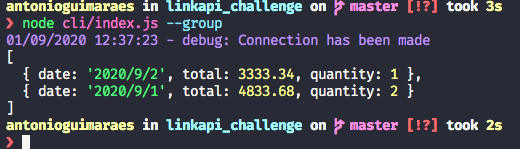
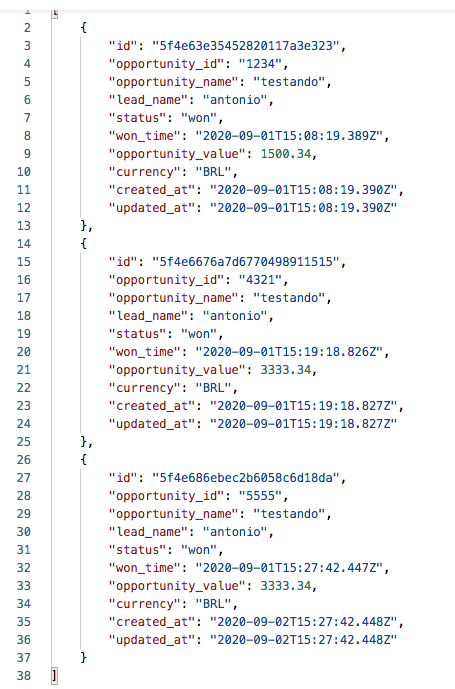
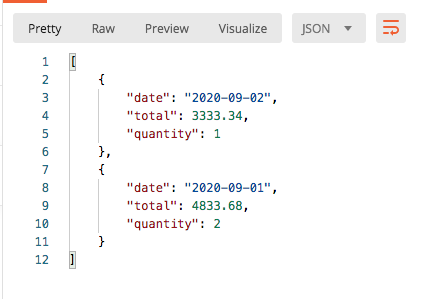

Olá pessoal, é um prazer fazer este desafio! 

Gostaria de agradecer a oportunidade.

Desafio: [link pro desafio!](challenge.md)

Setup (mac/linux):
-   1 - cp .env.example .env - Configure as credenciais no arquivo .env com seus dados do bling/pipedrive/mongo
-   2 - dê permissão no setup.sh com chmod +x setup.sh - Este script vai fazer todo o setup necessário e vai deixar os containers rodando em background.

## Tecnologias:

-   NodeJS 12
-   Docker
-   MongoDB

## Libs:
-   Winston para logging em memória
-   Bull para queue
-   Mongoose para persistência do mongo

O readme está em português mas o projeto é 100% feito em inglês.

REQUISITOS

- [x] Criar contas testes nas plataformas Pipedrive e Bling.
- [x] Criar uma integração entre as plataformas Pipedrive e Bling. (A integração deve buscar as oportunidades com status igual a ganho no Pipedrive, depois inseri-las como pedido no Bling).

- [x] Criar banco de dados mongo, existem serviços como MongoDB Atlas para criar de graça

- [x] Criar uma collection no banco de dados MongoDB agregando as oportunidades inseridas no Bling por dia e valor total.

Proof: 

- [x] Criar endpoint para trazer os dados consolidados da collection do MongoDB.

Endpoint`s disponíveis:
-   /list - Lista TODOS os itens da tabela opportunities sem paginação (não foi feita por falta de tempo/preguiça)

-   /totalByDay - Lista um dos requisitos, que é agrupar por dia e somar o total do valor da oportunidade do pipedrive, foi feito um endpoint 
e um cli command, o agrupamento foi feito usando aggregate e não percorrendo todos dados e agrupando via código, e sim usando um comando direto do banco.

-   Arquitetura utilizada: Clean Architecture ( tentei, não domino )

-   Desafio iniciado em: 31/08/2020 22:30
-   Desafio finalizado em: 01/09/2020 17:00

-    Utilizei token fixo para autorização mas poderia ter utilizado jwt, como não fiz um crud de usuário disponibilizei um token fixo p/ testes, no futuro basta mexer no middleware e criar a lógica de autorização.

-    Foi feito uma cron para sincronizar de 1 em 1 minutos as oportunidades ganhas do pipedrive ao bling
-    A thread principal sobe a api, existe um container exclusivo pra fila, usei o pacote bull que tenho familiariade, optei por utilizar um container exclusivo na fila porque podemos ter vários pods no kubernetes executando o mesmo comando e processando a fila com varios workers.

## Foram feitos os seguintes testes (teste de crud básico):
✓ drops database (358ms) -- limpa o banco de dados
✓ lists opportunities (178ms) - lista todas oportunidades
✓ find opportunity by opportunity_id (352ms) - procura uma oportunidade 
✓ delete a opportunity (536ms)

-   Link doc postman: https://documenter.getpostman.com/view/2492835/TVCe2p6Y

-   Link vídeo funcionando: https://www.youtube.com/watch?v=0FN8rhPk5Hk